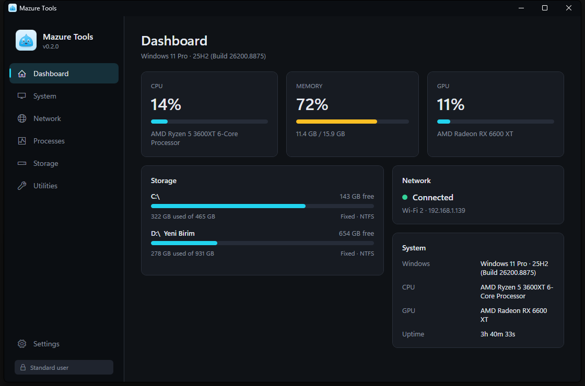
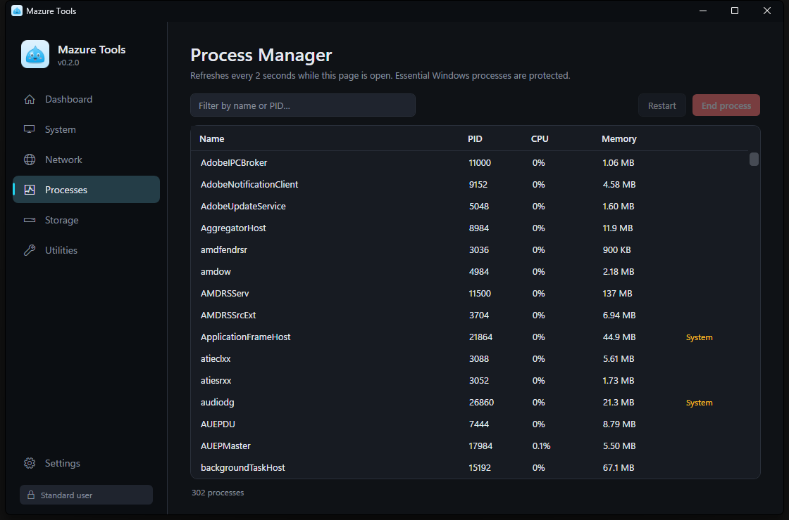
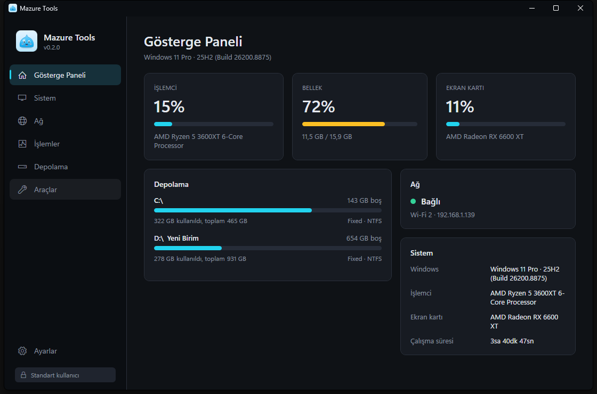
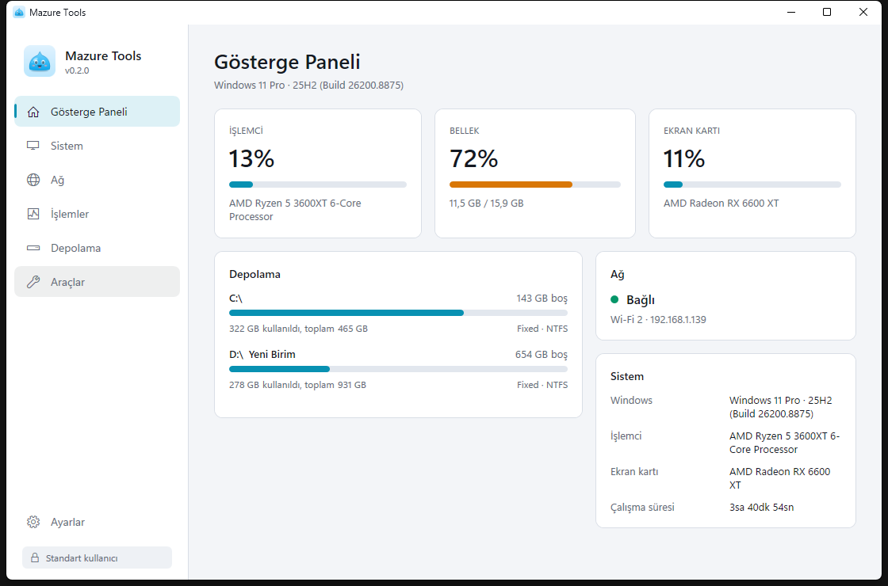
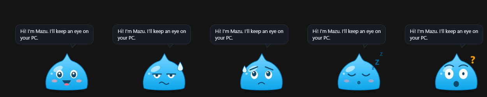

<div align="center">


# Mazure Tools

**Windows system and network utilities in one small, fast app.**
*Made by Claxe*

English · [Türkçe](README.tr.md)

</div>

Mazure Tools brings the tools that are normally scattered around Windows — task manager, `ipconfig`, `ping`, disk usage, hashing, port checks — into a single modern dark-mode window. It is portable (one `.exe`, nothing to install), has **no third-party packages** and **no telemetry**, and never changes your system without showing what it is about to do and asking first.

C# · .NET 10 (LTS) · WPF · MVVM · Windows 10 (1809+) / 11 · English and Türkçe

<p align="center">
  
  
</p>
<p align="center">
  
  
</p>

## Features

| Page | What it does |
|---|---|
| **Dashboard** | Live CPU / RAM / GPU load, disk usage, Windows version, CPU/GPU model, network status |
| **System** | CPU model and load, RAM total/used/free, GPU name and load, disks, Windows version, uptime |
| **Network** | Ping (min / avg / max latency, packet loss), DNS, gateway, local IP, public IP, adapter details, flush DNS cache, renew IP |
| **Processes** | Process list (name, PID, CPU, RAM), search, end, restart, with protection for critical Windows processes |
| **Storage** | Disk name, capacity, used, free, percentage; size of any folder |
| **Utilities** | SHA-256 / SHA-1 / MD5 (files and text, compare with an expected hash), port checker, open CMD / PowerShell / Explorer |
| **Settings** | **Language (English / Türkçe, applied instantly)**, dark/light theme, tray behaviour, start with Windows, show/hide the mascot, restart as administrator |

**System tray:** Open Mazure Tools · Dashboard · Network · Exit. Closing the window minimises to the tray (can be turned off).

## Meet Mazu

Mazu is a small blue slime that lives in the bottom-right corner of your screen, always on top, and reacts to what your computer is doing:

<p align="center"></p>

| Mood | When |
|---|---|
| Happy | everything is calm |
| Tired | the CPU has been above 90 % for about 10 seconds |
| Worried | memory is above 92 % or a fixed disk has less than 10 % free |
| Surprised | the network connection is gone |
| Sleepy | no keyboard or mouse input for 3 minutes (wakes up when you are back) |

Mazu talks in short, slightly silly speech bubbles (English and Türkçe, several lines per mood). **Click** for a chat (poke it five times quickly and it gets ticklish), **drag** it anywhere (the position is remembered), **right-click** for *Open Mazure Tools* / *Hide Mazu*. Turn it off in **Settings → Show Mazu**.

Cost: about 0.2 % of one CPU core and ~8 MB RAM while visible (CPU and RAM sampled once a second, the GPU counters stay closed). With Mazu off, the app in the tray uses no CPU at all.

## Download and install

Nothing to install, not even .NET.

1. Download `MazureTools-win-x64.zip` from the **[Releases](../../releases)** page (ARM64 PCs: `win-arm64`).
2. Extract it anywhere, e.g. `C:\Tools\MazureTools`.
3. Run `MazureTools.exe`.

Notes
- The exe is not code-signed, so Windows SmartScreen may warn on first launch → **More info → Run anyway**. If you downloaded the zip, right-click it → Properties → **Unblock** before extracting. Compare the zip with `SHA256SUMS.txt` from the release if you want to be sure.
- The first start unpacks WPF's native libraries once into a temp folder and takes a few seconds longer.
- Settings live in `%AppData%\MazureTools\settings.json`. To remove the app, delete the exe and that folder (turn off *Start with Windows* first if you used it).
- The ARM64 build compiles but has not been tested on ARM hardware.

The first launch picks **Türkçe** on a Turkish Windows and **English** otherwise; change it any time in **Settings → Language**.

## Build from source

You need the [.NET 10 SDK](https://dotnet.microsoft.com/download) on the build machine only:

```powershell
winget install Microsoft.DotNet.SDK.10

dotnet build            # build
dotnet run              # run
```

Make your own portable package (output in `dist\`):

```powershell
.\publish.ps1                                  # single file, .NET included (~170 MB, ~66 MB zipped)
.\publish.ps1 -Mode FrameworkDependent         # a few MB, target needs the .NET Desktop Runtime 10
.\publish.ps1 -Runtime win-arm64               # ARM64
```

`Build-Portable.cmd` does the default build with a double-click. Open `MazureTools.sln` in Visual Studio if you prefer.

Before opening a pull request run the dictionary check:

```powershell
.\tools\Test-Localization.ps1
```

## Safety

Mazure Tools starts as a normal user and **never elevates silently**.

- **Renew IP** (`ipconfig /renew`) shows what it will do, that the connection may drop briefly, and asks for confirmation. It needs administrator rights; if you are not elevated the app offers *Restart as administrator* (Windows' own UAC prompt appears; decline it and nothing changes).
- **Flush DNS cache** asks first, and asks for elevation only if Windows requires it.
- **End / restart process** always asks.
  - Critical processes (`System`, `csrss`, `wininit`, `winlogon`, `lsass`, `smss`, `services`, `Registry`, …) are **blocked** because ending them crashes or logs off Windows.
  - Windows components (`svchost`, `explorer`, `dwm`, `audiodg`, `spoolsv`, Defender, …) get an extra red warning and cannot be restarted from here.
  - The app cannot end itself from this screen, and it only acts if the PID still belongs to the process you selected (PID-reuse guard).
  - The guard is a name-based safety net against mis-clicks, **not** a security boundary against malware that copies a name.
- The **public IP** is only looked up when you press *Look up* (`api.ipify.org`, fallback `icanhazip.com`). Otherwise the app never connects to the internet.
- System tools are started directly from `System32` (no shell), and user input is never concatenated into a command line.
- CMD / PowerShell / Explorer open with the **same privileges** as Mazure Tools.

## Lightweight by design

- CPU/RAM/GPU sampling (1 s) runs **only** while the Dashboard or System page is visible; the process list (2 s) only while the Processes page is open.
- When the window is hidden in the tray or minimised, every page timer stops (measured: 0 ms CPU in 20 s with the mascot off; ~0.2 % of a core with Mazu visible).
- Network changes come from Windows events, not polling.
- The UI is rendered in software (avoids loading the GPU driver's Direct3D stack, ~60 MB less RAM, same CPU). Set `MAZURE_HW_RENDER=1` for hardware rendering.
- Measured on the author's PC: ~100 MB RAM including WPF and the .NET runtime; window opens in about a second.

## Architecture

```
Core/         MVVM base (ObservableObject, commands, PageViewModel), Loc (localisation), helpers, Native/ (P/Invoke)
Services/     App-wide services: dialogs, settings, theme, navigation, elevation, tray, window, single instance
ViewModels/   Shell view models: Main, Dashboard, Settings
Views/        Main window, Dashboard/Settings views, message dialog, shared controls and templates
Modules/      One self-contained module per tool: service interface + implementation + models + view model + view
  SystemInfo/   (not "System": that name would collide with the C# namespace)
  Network/  Processes/  Storage/  Utilities/
Languages/    Strings.English.xaml, Strings.Turkish.xaml
Themes/       Colors.Dark/Light.xaml (swapped live), Styles.xaml
Resources/    Icon, logo and mascot artwork
tools/        Icon generator, localisation check
```

Rules the code follows:
- **The UI never does system work.** View → view model → service interface (`INetworkService`, `IProcessService`, …). The Network page's button does not run a command; `NetworkService` does.
- Prompts go through `IDialogService`; view models know nothing about windows.
- Everything is wired in one composition root (`App.xaml.cs`); no DI container package was needed.
- Exceptions become readable messages (`ErrorMessages`); an unhandled exception in a command never kills the app.
- **Add a tool:** create `Modules/YourTool/` with a service, a `PageViewModel` and a `UserControl`, add it to `PageId`, map view model → view in `Views/Templates.xaml`, register it in `App.xaml.cs`, and add its texts to both language files.

### Translating / adding a language

All text lives in `Languages/Strings.*.xaml` and is looked up by key (`{DynamicResource Key}` in XAML, `Loc.T("Key")` in code), so the language switches live. To add a language copy `Strings.English.xaml`, translate the values, add the language to `AppLanguage` in `Core/Loc.cs`, and add a button in `Views/SettingsView.xaml`. `tools/Test-Localization.ps1` checks that keys and `{0}` placeholders match.

## Known limits and TODO

These are **not** implemented and are not presented as if they were. See also the [roadmap](ROADMAP.md).

- [ ] DNS server *changing* (only DNS info is shown and the cache can be flushed)
- [ ] Windows services management
- [ ] Restarting a process does not preserve its command-line arguments (stated in the confirmation)
- [ ] Process details (path, user, threads, command line)
- GPU load comes from the same "GPU Engine" counters Task Manager uses and shows the busiest engine; it shows **N/A** where Windows offers no counters (old drivers, some VMs). Nothing is invented.
- "Connected" is Windows' link state; it does not test internet reachability.
- Folder size adds up file sizes (not space allocated on disk), does not follow symbolic links, and skips what Windows denies.
- The tray context menu uses Windows' default (light) rendering.

## Contributing

Issues and pull requests are welcome — see [CONTRIBUTING.md](CONTRIBUTING.md).

## License

[MIT](LICENSE) © 2026 Claxe. Mazu and the logo are original artwork made for this project and are covered by the same license.
